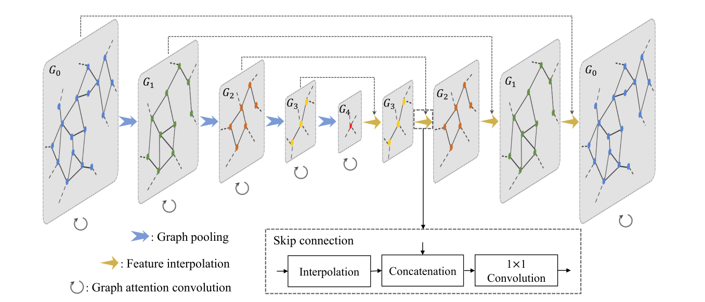

# Graph Attention Convolution for Point Cloud Segmentation

This is personal pytorch implmentation of GACNet on S3DIS dataset, but **not official version**.

## Download Data
Run `download_data.sh` and save dataset in `./indoor3d_sem_seg_hdf5_data/`

## Train Model
Run `python train_semseg.py`

## Announcement
It is only a **personal implmentation**, and the experimental results **do not represent the model in paper**. There are still many hyper parameters that need to be adjusted when the author publishes the source code.

## Environments
Ubuntu 16.04  
Python 3.6.5  
Pytorch 0.4.1  
